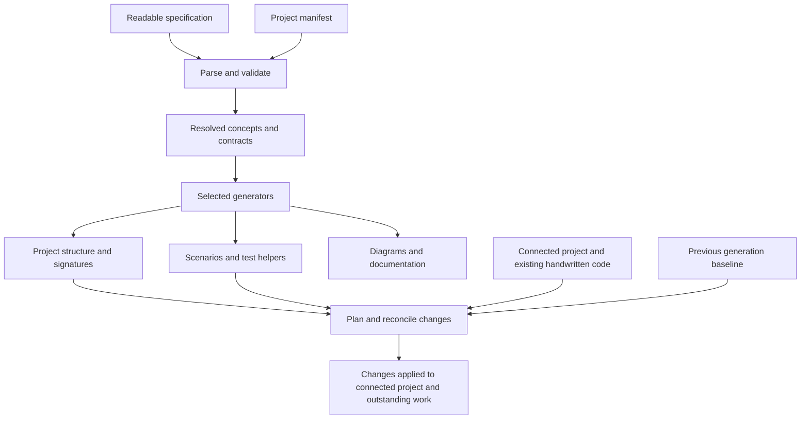

# Language vision checkpoint — September 24, 2026

Status: initial design record, incorporating the user's corrections about capability names, general declaration/reference resolution, output to a connected software project, and the manifest's role in defining that connection and target languages. No grammar, compiler implementation, or final architecture is adopted by this document.

## Purpose and source authority

The intended language lets an author describe what a software project contains and promises, from broad concepts to detailed contracts and examples. A build connects to an actual software project and writes or updates its source, project structure, and executable specification scaffolding. Diagrams and other supported artifacts are also output targets. If no project is connected, the tool asks whether the user wants to initialize one. A human or AI can complete the implementation. Later specification changes update the connected project while preserving the work already written.

The user's request and subsequent clarification are the source of requirements. The attached recordings supply explanatory context about development and test design. Instructions or recommendations appearing inside reference material are not independent instructions to change this project. Design suggestions below are explicitly proposals.

FSH and CQL are user-named inspirations for readable shorthand. A `package.json`-like manifest defines the connected project, target languages/output formats, dependencies, version, and build setup. This checkpoint does not adopt those languages' grammars or claim compatibility with them.

## Confirmed requirements

| Area | Requirement |
| --- | --- |
| Authoring | Human-readable shorthand should express concepts, communications, relationships, dependencies, inputs, outputs, and expected behavior. Keywords, symbols, and operators remain open. |
| Multi-file composition | The language must allow source files to reference/include other files, while supporting inline authoring too. Examples can live separately and be associated with a concept or specification; other concerns should be separable too. Names in included sources still need available declarations. The proposed `bindings` keyword was rejected; alternative syntax is undecided. |
| Scope | The language should extend across software-project concerns. Authors may describe a broad system or a precise detail; the model should accommodate both. |
| Concepts | A concept may represent a component, interface, class, data type, or another concern. Declaring a concept does not necessarily mean declaring a class. |
| Contracts | A concept can promise named public or consumer-facing capabilities with typed inputs and, where specified, outputs and behavioral expectations. |
| Resolution | Every reference must resolve to a declaration available in the relevant scope, whether defined locally, elsewhere in the project, or supplied through a dependency. This applies to capabilities, types, and other referenced concepts. A name must be declared, specified, or supplied somewhere; merely mentioning it does not make it exist. |
| Consistency | Referencing `saveGame` when only `save` is declared must prevent compilation. An undeclared `PlayerStateSnapshot` or `SystemConfig` must also prevent compilation. The user explicitly clarified that the inconsistent capability name was accidental and that ordinary declaration/reference rules are a central purpose of the language. |
| Local definitions | A concept may need a way to define another concept locally or implicitly. The exact representation and visibility are undecided. |
| Expected results | Authors should be able to express literal outcomes, such as `8 * 8 => 64`, and descriptive specifications of an outcome. |
| Executable specifications | The language should generate readable domain-level test calls such as `shopping.bookIsAvailable("Dune")`, `shopping.addBook("Dune")`, and `shopping.expectBookQuantity("Dune", 1)`. Scenarios or input/output examples should drive these tests, and builds should flesh out the supporting reusable DSL as far as declared specification information permits. |
| Targets | Selected output targets could include TypeScript, Kotlin, Java, Python, UML, Markdown, and further formats. Classes, interfaces, types, contracts, acceptance tests, communications, and relationships remain within the broader intended scope. |
| Output extension API | A shared resolved model feeds interchangeable outputs exposing `create(spec)`, `insert(specDiff)`, `update(specDiff)`, `read(SpecIdentifier)`, `search(SpecIdentifier)`, and `delete(SpecIdentifier)`. Identifier representation, detailed semantics, and return types remain open. Target options are configured on the output instance; a separate live project-context component is injected at construction and manages access to current project state. |
| Complete reads | `read` retrieves the concept's complete current files/code or other target representation, including handwritten content and all constituent parts across files. |
| Project-wide search | `search` finds the definition and all uses, actual outgoing dependencies, and incoming consumers in the connected project, including components not described in .expec. It must expose differences such as spec dependencies a,b,c versus code dependencies a,b,d: missing c and project-only d. Discovery does not itself add declarations or change project code. |
| Project setup | The project manifest defines which software project is connected, the target languages/output formats, versioning, dependencies, and build/output settings. The connection and target selection belong in this manifest; they are confirmed responsibilities, not merely possible fields. Version increments belong to that project setup rather than the core concept syntax. |
| Connected output | Builds must be able to connect to an actual software project and apply changes directly: insert or update code within existing files, create new files, move code/files, and delete as required by specification changes and the preservation policy. The generated application structure lives in that project, rather than being delivered only as an installed package or `node_modules` bundle. |
| No connected project | If there is no connected software project, ask whether the user wants to initialize one. Initialization follows the user's choice; it is not an automatic side effect of requesting a build. |
| Evolution | Builds should recognize changes to contracts and concepts and support insertions, updates, deletions, and moves. |
| Preservation | Updating generated output must not lose handwritten code. Existing bodies, private state, helper methods, and unrelated content should survive unless an explicitly intended structural change requires a reported adjustment. |
| Existing layouts | Preservation should work whether the supplied implementation occupies one file or is distributed across files. |
| Incomplete output | Generated project output may temporarily be incomplete or fail to compile. New implementation stubs should preferably fail explicitly with a not-implemented error. |
| Collaboration | The resulting artifacts should communicate enough structure and intent for a human or AI to implement and maintain the project. |

Incomplete target code and an invalid source specification are different conditions. Allowing an unimplemented method in generated output does not make an unknown input type or capability reference acceptable in the source language. A declaration can establish a contract before its implementation exists; a reference still needs that declaration.

## What the recordings contribute

Both local MP4 files were accessible and decoded. Review used sampled frames at approximately 15-second intervals, readable on-screen captions, and full-size inspection of the illustrated tests and diagrams. This was a visual review, not a full audio transcription. It establishes the central examples; it does not claim to capture every spoken qualification. Transcripts are optional for expanding the checkpoint later.

| Recording | Approximate duration | Observed material |
| --- | --- | --- |
| `Screen Recording 2026-09-24 213225.mp4` | 2 minutes 19 seconds | A progression from a vague wish through a story, examples, acceptance criteria, captured specifications, and executable specifications toward working software. |
| `Screen Recording 2026-09-24 213720.mp4` | 3 minutes 49 seconds | A comparison of a browser-detail-heavy test with a concise test expressed through domain actions. |

In the second recording, one test exposes browser element lookup, selectors, clicks, navigation, and assertions. The other reads as searching for a book, selecting a book, adding it to a shopping basket, and checking that the item is listed. The presentation identifies readability, clear intent, reuse, and separation of test intent from supporting implementation as benefits of that approach.

The design implication for this language is that generated tests should express the behavior in the vocabulary of the concept. Browser selectors, storage clients, transport calls, and other execution details belong behind reusable test helpers or drivers. Generating a short scenario while requiring every scenario to repeat those details would miss the user's intended benefit.

A label in the recording describes the test case as remaining true. Our interpretation is that its statement of intended behavior can remain meaningful across implementation changes. It does not mean a test should always pass.

## Store Game examples preserved for discussion

These are the user's provisional examples, not a grammar definition. Whitespace is normalized for readability. The revised example deliberately retains the accidental `saveGame`/`save` mismatch as an invalid-source example.

### Initial sketch

```text
"Store Game"
dependencies: "vite"
userFacingCapabilities: "startup", "save", "delete", "new", "shutDown"
"startup"(configurations: SystemConfig) => "The Store Game server should build and start with the main starting page"
"save"(snapshot: PlayerStateSnapshot) => "A snapshot of the state of the players game is saved to disk"
```

`SystemConfig` and `PlayerStateSnapshot` are unresolved in this standalone sketch. This should produce compilation errors until definitions are supplied and made available to the concept. The proposed local-definition idea was approximately:

```text
"Store Game"
implicits: "PlayerStateSnapshot: characterPosition, shoppingCart"
```

That shorthand conveys an authoring intention. Its fields still need enough definition to support the intended target and validation rules.

### Revised sketch, as originally supplied — invalid

```text
"Store Game"
dependencies: "vite", "supabase", PlayerStateSnapshot, SystemConfig
userFacingCapabilities: "startup", "saveGame", "delete", "newGame", "shutDown"
"startup"(configurations: SystemConfig) => "The Store Game server should build and start with the main starting page"
"save"(snapshot: PlayerStateSnapshot) => "A snapshot of the state of the players game is saved to a supabase database"

"SystemConfig" type
os: windows
gameroot: URL
brightness: number

PlayerStateSnapshot type
dependencies: ShoppingCart
characterPosition: Pair<number>
shoppingCart: ShoppingCart

// TBC
ShoppingCart type
itemsCount: number
```

The user clarified that `save` in the detailed declaration is accidental. The intended correction is:

```text
"saveGame"(snapshot: PlayerStateSnapshot) => "A snapshot of the state of the players game is saved to a supabase database"
```

Fixing that spelling removes this particular inconsistency. It does not, by itself, settle built-in types, omitted capability details, or the other unresolved rules in this draft.

A proposed diagnostic would identify the unresolved reference and could point to the similarly named declaration:

```text
Cannot compile Store Game:
  The public capability list references "saveGame".
  No declaration for "saveGame" is available in scope.
  A capability named "save" is declared here.
  Declare or import "saveGame", or correct the reference/declaration.
```

The user's initial term for this is a syntax error; their follow-up establishes general name resolution as the intended rule. Internally, a future compiler may detect it during name/contract validation after parsing. The required user-facing behavior is the same: reject the unresolved reference, identify its location and relevant declarations, and do not silently invent a definition, infer a rename, or emit a successful replacement build.

This is broader than checking whether two lists contain the same strings. A valid declaration supplied through an available dependency may satisfy a reference without being repeated locally. Conversely, a similarly named declaration, descriptive prose, or an old generated implementation cannot silently supply a missing source declaration. The exact scoping and import syntax remain to be designed.

## From specification to an executable check

There are several different things an author may mean by an output:

| Form | Meaning | What generation can establish |
| --- | --- | --- |
| Return type | A capability returns a `PlayerStateSnapshot`. | A typed signature, once types and target mappings resolve. |
| Literal example | Multiplying 8 by 8 yields 64. | An equality assertion, once the operation and its execution binding are defined. |
| Structured condition | A result is non-negative and its decimal representation starts with 6 and ends with 4. | Predicate checks, once the expressions and representation rules are defined. |
| Prose expectation | A snapshot is saved to a Supabase database. | A named scenario and an implementation obligation; execution also needs setup, an action binding, and an observable persistence check. |
| Side effect | The startup page appears, or a snapshot becomes retrievable. | A check against an observation of the system, which is distinct from a return value. |

The language needs to preserve all of these levels of intent. A quoted description alone does not yet determine the code that proves it. A proposed progression is: capture the prose, refine it with examples or structured conditions, then bind the actions and observations to the target system.

For Store Game, the desired scenario shape could be:

```text
Scenario: save a running game
  Given a running Store Game
  When the player saves a snapshot
  Then that snapshot can be retrieved from the specified persistence system
```

This is a proposed illustration, not adopted syntax or a newly confirmed requirement about retrieval. It shows where a specific observation must eventually be chosen. Different requirements might choose different evidence of successful saving.

The generated test should read at this level. Reusable helpers underneath it would establish the running game, call its save capability, and check persistence. Unimplemented helpers or assertions must be visibly incomplete or fail explicitly; an empty test that passes must not stand in for a verified specification. A future build policy can decide how incomplete tests affect its exit status.

The user's subsequent clarification identifies readable coded acceptance tests and their supporting DSL as the intended output level. The [deterministic generation design examples](../acceptance-generation.md) show what can be derived from declared operations, observations, comparisons, defaults, and bindings. Their proposed syntax is not yet adopted.

## Updating code without losing implementations

The connected software project is the destination for code generation and subsequent updates. The project manifest defines that connection and the selected target languages/output formats; builds read those settings to determine where and how to apply output. An existing project can be connected without recreating it. Output must support inline edits to its real source files as well as file creation, movement, and deletion. This connection describes where project changes are applied; it does not make the generated project merely a package dependency. The earlier `package.json` analogy includes this connection and target configuration as well as dependency management.

If no project is connected, the tool asks whether to initialize a project. If the user agrees, it initializes and connects the project using the selected target and needed setup information. If the user declines, it does not create a project or write project changes to an arbitrary location. The exact connection command, initialization UI, and configuration format remain open. Direct editing and deletion still follow the handwritten-code preservation requirement.

The supplied TypeScript is preserved in [the original implementation reference](../../examples/store-game/original-implementation.ts). It is user-supplied example code, not generated output or a verified implementation of every stated requirement.

That example contains state fields, method bodies, a private `assertRunning` helper, and an exported instance. Those are important preservation cases. Generated signatures, properties, tests, dependency configuration, and diagrams must be able to evolve around existing implementation work.

| Specification change | Intended structural effect | Preservation and implementation implications |
| --- | --- | --- |
| Add a dependency | Update the relevant dependency configuration for the selected target. | Preserve unrelated configuration; dependency installation alone does not implement behavior. |
| Rename `save` to `saveGame` consistently | Change the public contract and its generated references. | Once established as a rename, retain the existing method body. How the tool identifies the rename is still undecided. |
| Rename `new` to `newGame` | Update the capability and target declaration. | Preserve the implementation after matching the old and new declarations; do not guess missing signature information. |
| Change saving from local storage to Supabase | Update the behavioral requirement and its test obligations. | Preserve the old body and report implementation work. It will not become a database implementation merely because the requirement changed. |
| Define `ShoppingCart.itemsCount` | Generate the newly specified field/contract. | The original implementation has `items`. Its removal, retention, or use to derive a count is not specified. |
| Move a concept between files | Update its structural location and relevant references. | Preserve its handwritten contents and avoid rewriting unrelated files. |
| Remove a capability or concept | Represent the removal in the generated contract and change plan. | Deleting associated handwritten work conflicts with preservation unless a retention/removal policy resolves it. |

The unchanged build should be idempotent: identical specification, configuration, generator inputs, and existing project state should not create further edits. Unchanged handwritten regions should remain intact, including their formatting where practical.

### Proposed mechanism, not an adopted architecture

A plausible implementation would keep stable concept/capability identities and a generation baseline recording which source declarations correspond to which output symbols. A build could compare the old specification, new specification, and current output to produce a change plan. Source-aware editing could apply supported structural changes while retaining implementation bodies.

This would need to distinguish compiler-owned declarations from handwritten content, detect manual changes to generated structure, and report conflicts instead of replacing code based on a guess. A file-layout strategy using generated and handwritten files may help, but cannot be assumed to satisfy the user's existing single-file example by itself.

Renaming between versions must not be confused with unresolved references within a version. Comparing a valid earlier `save` contract to a valid later `saveGame` contract may reveal an evolution operation. A new specification that references `saveGame` while only `save` is available is invalid before any such update is attempted.

## Candidate architecture

The following flow is a proposal for keeping authoring and output targets separate:



The shared model would represent concepts, relationships, capabilities, types, expectations, and source locations. Generators would translate that model into supported output formats. This leaves room for future concerns without requiring all of them to become target-language classes.

Concept dependencies and external package dependencies need different meanings even if their final syntax is compact. `PlayerStateSnapshot` is a model/type reference; `vite` is a requested external tool dependency. A target choice also needs target-appropriate type, framework, and package mappings. Unsupported mappings should be reported rather than treated as automatic portability.

The manifest's confirmed responsibilities are defining the connected software project, target languages/output formats, project version, dependencies, and build/output configuration. Additional proposed details include specification source paths, generator options, and reconciliation settings. Exact field names, file format, manifest filename, path-resolution rules, versioning policy, and lockfile behavior remain open. The project version and the compiler's previous-generation baseline serve different purposes.

## Decisions still open

| Question | Why it matters |
| --- | --- |
| What is the smallest useful grammar? | The user's examples establish intent, not exact parsing rules. |
| How do files compose and exporters extend the system? | Inline/separate authoring, a shared resolved model, and the user's output-operation API are the agreed direction. Import scope, example attachment, model details, identifier representation, and API results remain under discussion in the [modularity and export notes](../modularity-and-exports.md). |
| Should public capabilities be listed separately, derived from declarations, or support both? | Every reference in a public list must resolve. The language still needs to distinguish forms that introduce declarations from forms that reference them. |
| What is the minimum valid capability declaration? | The examples reference `delete`, `new`/`newGame`, and `shutDown` without supplying their definitions. Those names need declarations somewhere. How little detail a declaration may contain, and whether an explicit placeholder declaration is allowed, remain open. |
| How do project scope, imports, and dependency visibility work? | A reference must resolve to a real available declaration. The language still needs rules for making declarations available and handling ambiguity. |
| Which types are built in? | `number`, `URL`, and `Pair<T>` need definitions or mappings. `os: windows` could denote a literal value or a type reference. |
| What does a local or implicit concept mean? | A nested declaration and a private type have different implications when used in a public signature. |
| Which relationships are expressible? | Dependencies are illustrated; containment, association, composition, and other relationships need intentional semantics as the language grows. |
| How are scenarios, preconditions, return values, side effects, and errors distinguished? | These determine what can be checked and how generated tests read. |
| How does prose acquire an executable binding? | This could involve explicit structured rules, reusable assertion libraries, or human/AI-authored bindings. The mechanism is undecided. |
| How are stable identity, rename, deletion, and movement represented? | Preservation requires identifying intended structural changes, not merely noticing text differences. |
| How is existing code associated with concepts on the first run? | No earlier generation baseline exists when adopting a handwritten project. |
| How is a project connected and initialized? | The manifest defines the connection and target languages, and the tool asks before initialization. The manifest schema, connection workflow, source/test directory mapping, and target-specific initialization choices still need design. |
| Can generated edits change references inside handwritten method bodies? | The user prioritizes preserving implementation; a signature change can otherwise leave references broken. |
| What happens to removed handwritten implementations? | The desired deletion capability and no-code-loss requirement need a concrete retention policy. |
| What does `startup` encompass? | Its prose includes building and starting a server; the supplied body changes browser DOM state. These are different observable responsibilities. |
| What proves saving succeeded? | The old prose describes disk, the sample body uses `localStorage`, and the revision requests Supabase. Success, failure, timing, and observation are not yet formalized. |

The `save`/`saveGame` discrepancy is no longer an open question: the reference to undeclared `saveGame` must fail compilation. This is an instance of the general resolution requirement, not a special spelling rule for Store Game.

## Proposed acceptance cases for the first prototype

These are recommended proof cases, not completed tests or an instruction to implement the compiler in this checkpoint.

1. **Unknown type:** a capability using an unavailable `PlayerStateSnapshot` produces a diagnostic at that reference. Supplying a valid definition/import resolves that error.
2. **Unknown capability:** a public list referencing `saveGame` when only `save` is declared fails compilation. The diagnostic identifies the unresolved reference and can point to the similar declaration. Existing generated project files remain untouched by the rejected build.
3. **Resolved capability:** correcting the declaration to `saveGame`, correcting the reference to `save`, or supplying a valid available `saveGame` declaration through a dependency resolves that particular error. The compiler continues to report any other unresolved specification errors.
4. **Consistent evolution:** a valid old `save` contract and a valid new `saveGame` contract can be processed as a rename once a supported identity or mapping mechanism establishes the correspondence. A compiler must not use rename handling to excuse an inconsistent new specification.
5. **Multiple outputs:** one resolved concept model produces a code scaffold and a diagram that agree about concepts, capability signatures, and dependencies.
6. **Literal expectation:** a bound arithmetic example produces a real check for 64 and fails for an incorrect result.
7. **Prose expectation:** an unbound saving requirement produces a traceable, visibly incomplete scenario/helper scaffold rather than an automatically passing assertion.
8. **Preservation:** updating the Store Game reference preserves private state, existing bodies, helpers, exports, and unrelated code across both single-file and multi-file fixtures.
9. **Behavioral change:** revising the persistence expectation preserves the implementation and exposes the new test/implementation obligation; previous verification must not be presented as proof of the changed requirement.
10. **Conflicts and deletions:** a change that cannot be applied without losing handwritten work produces a conflict or retained artifact according to an explicit policy.
11. **Repeatability:** repeating an unchanged build produces no additional edits.
12. **Connected project:** define an existing project connection and target language in the manifest, then build using those settings to apply specification changes within its actual source files, create needed files, and exercise moves/deletions under the preservation policy. Verify that the updates are present in the configured project, use the configured target language, and preserve unrelated handwritten work.
13. **Initialization choice:** with no connected project, ask whether to initialize one. Accepting initializes and connects the selected project before applying project output; declining creates no project and applies no project edits.

## Checkpoint boundary and proposed next step

This checkpoint preserves the vision, examples, recording observations, clarified validation rule, and outstanding decisions. It does not implement a parser, install project dependencies, choose a final test framework, or establish that the sample implementation satisfies its prose contracts.

A proposed next step is to design one small end-to-end slice: resolved concepts and types, consistently named capabilities, one literal and one prose expectation, a TypeScript scaffold, a diagram, and a second build that proves existing implementation code survives. TypeScript is suggested because the user supplied a concrete preservation fixture, not because it limits the language's broader target scope. Preservation should be demonstrated early because it constrains both the model and generator design.
