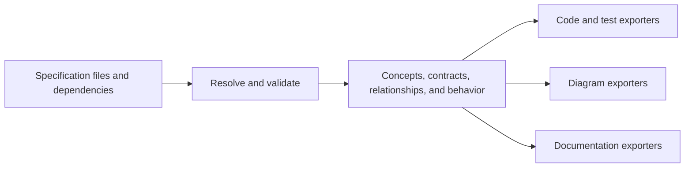

# Multi-file specifications and extensible outputs

Status: collaborative design notes, not an adopted grammar or implemented API. The user wants to explore alternatives before settling the design.

## Confirmed direction

The language must support referencing or including other source files. Examples may live in a dedicated file and be associated with a specification; the same flexibility should extend to other specification concerns.

The broader goal remains a shorthand executable specification language for classes, interfaces, types, dependencies, inputs, outputs, contracts, acceptance tests, communications, and relationships. Acceptance-test generation is one part of that scope. Selected outputs can include TypeScript, Kotlin, UML, Markdown, and further formats through a well-designed extension API.

The user has accepted inline and separate-file authoring and the shared resolved model followed by interchangeable outputs. They have rejected `bindings` as a proposed language keyword. Their preferred output API is `create(spec)`, `insert(specDiff)`, `update(specDiff)`, `read(SpecIdentifier)`, `search(SpecIdentifier)`, and `delete(SpecIdentifier)`. Target options are configured on the output instance, and a separate live project-context component is supplied when the instance is constructed.

The user clarified that read retrieves all of the concept's current representation, including its actual files/code, and search finds its definition and all uses in the connected project. Search must expose real dependencies and consumers even when they are absent from the specification. These meanings are confirmed; identifier encoding and result schemas remain open.

Other syntax, file structure, and detailed operation semantics remain proposals. The earlier draft notation is equally open to revision. Confirmed requirements should be recorded separately from candidate solutions so that exploring an idea does not accidentally turn it into a commitment.

## File composition

A possible layout is:

```text
expec.manifest.json
specs/
  shop.expec
  shopping.expec
  shopping.examples.expec
  shared-types.expec
```

The manifest still configures the connected project, dependencies, source entry points, and selected output targets. Language-level references compose the specification itself.

For discussion, `shop.expec` could contain:

```text
use Shopping from "./shopping.expec"
examples for Shopping from "./shopping.examples.expec"
```

These represent different relationships. `use` makes a declaration available; `examples for` associates examples with that declaration. Their spelling is still illustrative. Execution mappings may also need a place in the specification, but their syntax is undecided; the rejected `bindings` keyword is not part of this proposal.

The concept file could contain the Shopping action, observation, and expectation declarations from the [acceptance-generation sketch](acceptance-generation.md), with its types explicitly imported from a declared core dependency. The examples file could then contain:

```text
scenario "a shopper can add an available book"
  given bookIsAvailable("Dune")
    and startWithEmptyBasket()
  when addBook("Dune")
  then expectBookQuantity("Dune", 1)
```

In this proposed attachment form, `examples for Shopping` explicitly establishes the concept scope used to resolve those operation names. It does not introduce new operations. An unknown operation still fails validation, with a diagnostic pointing to its reference in the examples file. A separate design could require the example file to import and name its concept itself; both approaches are worth trying before choosing one.

The user explicitly confirmed that authors should be able to keep a small concept and its examples together, and extract the examples when the file grows. Source file boundaries should not dictate generated classes or force one file per concept. Organizing by feature, concept, or concern should remain possible.

I recommend semantic composition rather than literal text pasting. The compiler would load declared sources, collect their declarations, resolve references and attachments, and report duplicates or ambiguous names. Source order should not resolve conflicts by silently choosing the last definition.

Declaration identity should survive a file move; paths alone are insufficient identifiers for code-preserving updates. Mutual type references also differ from an invalid cycle in constant evaluation or setup execution. Cycle rules need to distinguish these cases instead of rejecting every cross-file cycle.

## One resolved model, several outputs

The agreed architectural direction is a common model of the specification's meaning:



This model would preserve declarations, types, capability signatures, expectations, scenarios, communications, relationships, source locations, and identities. Exporters should consume resolved meaning rather than each parsing .expec independently.

The shared model should not assume every concept is a class or that a TypeScript construct is the universal representation. Target mappings can translate common meaning into classes, interfaces, functions, records, diagrams, or prose as appropriate. Explicit target-specific detail remains useful when the author needs it; it should not be required for every general statement.

An output can only express information actually specified. This is not a requirement to write different specifications for each format. For example, the single fact "StoreGame depends on Storage" establishes a connection and can appear in code, Markdown, or a relationship diagram. That fact alone does not say whether StoreGame asks Storage to save before or after another action, or what response follows.

If the specification also describes an interaction sequence, a diagram exporter can render its order and a documentation exporter can describe the same order. A sequence could come from a scenario or another supported interaction description in the common model. Authors should specify the facts once; outputs select and render those facts. When a requested view lacks needed information, the exact response (partial view, explanation, or required-detail diagnostic) remains a design choice. The earlier sequence-diagram example was an illustration of this information boundary, not a new required workflow.

## Output API direction

The user proposes this operation surface:

```text
create(spec)
insert(specDiff)
update(specDiff)
read(specIdentifier)
search(specIdentifier)
delete(specIdentifier)
```

`specIdentifier` has the abstract type `SpecIdentifier`. It is not committed to a concept name, string, UUID, qualified path, or any other representation. A stable identity that survives renames and file moves is a recommendation, not a selected encoding.

Target options and a live project-context service belong to the configured output instance rather than being repeated as arguments on each operation. Illustrative construction looks like this:

```typescript
const projectContext = new ProjectContext(projectConnection);
const output: SpecOutput = new TypeScriptOutput(targetOptions, projectContext);

await output.create(spec);
await output.insert(specDiff);
await output.update(specDiff);
await output.read(specIdentifier);
await output.search(specIdentifier);
await output.delete(specIdentifier);
```

The calls above illustrate the API individually, not a required create/insert/update/read/search/delete sequence. The class names, asynchronous convention, and exact constructor form are provisional. A Kotlin or Markdown output would implement the same operation surface with its own configured options.

The context component manages access to the actual connected project's current state. Inject the component, not a one-time copy of the files. An operation obtains current context when it runs. A proposed consistency mechanism is to obtain a coherent view for the operation and detect intervening edits before applying its changes. This would protect handwritten work when the project changes after a diff was prepared, without adding project-context arguments to the public operation signatures.

Operation responsibilities are below. Read and search reflect the user's clarified requirements; the remaining descriptions elaborate the requested operation names and still need detailed API decisions.

| Operation | Responsibility |
| --- | --- |
| `create(spec)` | Create the initial target representation of the supplied resolved specification. Whether the supplied unit is a whole project or a selected subset remains open. |
| `insert(specDiff)` | Add newly specified elements to the connected output. |
| `update(specDiff)` | Apply changes to existing mapped elements, including supported renames or moves. |
| `read(specIdentifier)` | Retrieve the concept's complete current target representation: actual source/files or other artifacts, including handwritten content and all constituent parts when spread across files. It is not limited to the declared signature, generated regions, a summary, or an old build baseline. |
| `search(specIdentifier)` | Find the definition and all uses of the identified thing in the current connected project, including actual outgoing dependencies and incoming consumers. Include code and components absent from .expec so that differences between intended and actual relationships can be detected. |
| `delete(specIdentifier)` | Remove the associated target representation subject to the existing handwritten-code preservation policy. |

`spec` should be the shared resolved specification. I recommend that `specDiff` express changes to that model rather than target-language text edits, so the same semantic change can drive several output implementations. The precise diff schema, missing/already-existing behavior, mixed-change handling, operation granularity, and return types are still open.

### Complete reads and project-wide discovery

For a concept that occupies one source file, read must expose its complete current content, including private implementation and comments. If the representation spans multiple files or artifacts, read must include all of its parts with enough source context to locate them. How shared files, non-text artifacts, and content handles are represented in the return schema is still open; a signature-only response does not satisfy this requirement.

Search is an inspection of the live project, not just a lookup in the spec's generated-symbol table. It should locate the target definition, its references, and its actual relationships, including project-only code. For example:

| Relationship for StoreGame | Observed value |
| --- | --- |
| Dependencies declared in .expec | a, b, c |
| Dependencies found in connected code | a, b, d |
| Present in both | a, b |
| Declared dependency missing from StoreGame's code relationships | c |
| Dependency present in code but absent from that specification | d |

The difference concerns StoreGame's dependencies: c might exist elsewhere in the project without StoreGame using it. Search results must expose enough actual definitions, uses, and relationships to detect the difference. The build has the intended resolved specification for comparison; whether the output search result includes the comparison directly or another component formats it remains a return-contract detail. No extra per-call configuration or project-context argument is required.

If a handwritten AdminPanel calls StoreGame but has no .expec declaration, search must still find and identify that use. Discovering AdminPanel or d does not declare either in .expec, make unresolved source references valid, or authorize deleting them. Read and search inspect rather than mutate the project.

Target-aware reference analysis must distinguish the intended symbol from unrelated namesakes and textual mentions. A proposed result contract should expose source locations and inspection coverage; when a target adapter cannot resolve some dynamic uses, it should report incomplete coverage rather than claim proven absence. This is a proposed reporting mechanism, not a narrowing of the desired search scope.

An output extension could declare its implementation identifier, supported API/model version, supported specification features, and configuration requirements. Operation results could carry artifacts or representations, change summaries, source-to-output mappings, diagnostics, and unfinished obligations as appropriate. Those are candidate result contents, not a replacement for the user's operation API.

Validation, ownership records, conflict handling, and applying edits still need coordination. That can happen inside or beneath this operation surface; callers need not pass the full context into every call or use a separate plan-only API. The output implementation or a companion adapter still needs target-aware knowledge to preserve and edit source correctly. A shared context service cannot safely rename arbitrary Kotlin or TypeScript declarations just by replacing text, and whole-file replacement alone cannot satisfy preservation of arbitrary handwritten implementations.

Multiple exporters may contribute to one project, so their proposed changes need coordination rather than independent writes that overwrite each other. Unsupported required features should produce diagnostics. Deliberately selected partial views, such as a type-only diagram, are different from silently omitting required behavior from a code target.

Adding a new output target should not require editing the language parser. Adding a new language concept or behavior may require a separate semantic extension mechanism. Those are distinct extension problems; designing both around one unrestricted plugin hook would make validation and compatibility harder to reason about.

## Concrete examples to refine together

1. Move the shopping scenario from its concept file to `shopping.examples.expec`, attach it, and obtain the same domain test behavior and contracts.
2. Misspell `expectBookQuantity` in that included file and receive an unresolved-reference diagnostic naming that file and location.
3. Reuse one declared type from two concept files without duplicating its identity or creating two generated types accidentally.
4. Add a Markdown exporter through the extension API and render the same resolved contracts and examples without modifying the parser.
5. Describe a StoreGame-to-Storage interaction once and render its declared order as both documentation and a sequence diagram. A dependency-only input must not invent that order.
6. Apply a code export after moving source files and preserve associated handwritten implementations.
7. Modify the connected source after constructing an output instance, then invoke `read` or `update` and observe that it uses current project state rather than constructor-time file contents.
8. Apply the same model change through configured TypeScript and Markdown outputs without resupplying target options or project context on every operation.
9. Read StoreGame and receive its complete current implementation across its files, including handwritten private content that is absent from the specification.
10. Search StoreGame and find its definition, all supported uses, project-only consumers, and actual dependencies; compare a,b,c in the spec to a,b,d in code and expose missing c and project-only d.

Open choices include named versus namespace imports, whether example files import their subject or receive an explicit attachment scope, how partial concept definitions combine, the representation of SpecIdentifier, semantic diff structure, target-specific mappings, and result schemas for complete content, definitions, references, and coverage. The responsibilities of read and search are now settled. These remaining choices are design conversations to work through using small examples, not decisions already made.
